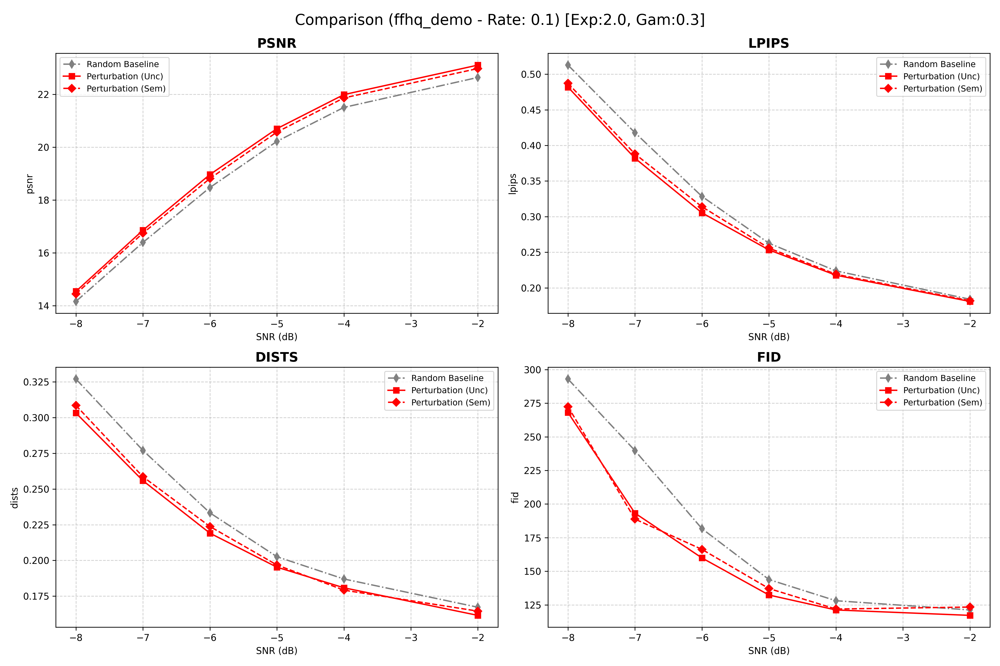
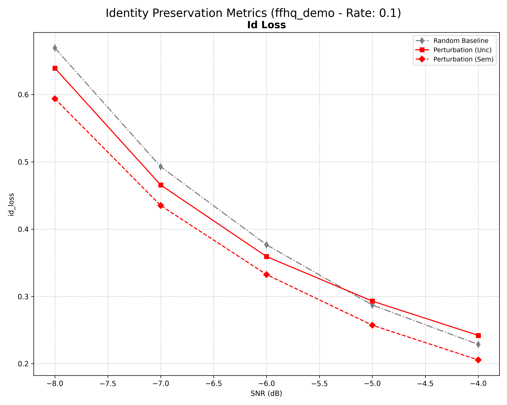
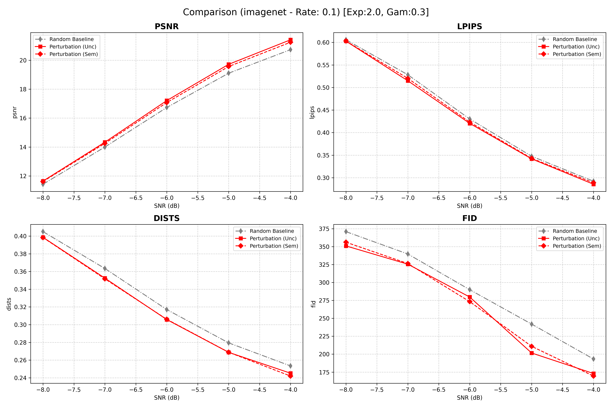

# DiffCom: Semantic Retransmission with Uncertainty Guidance

このリポジトリは、論文 **"DiffCom: Channel Received Signal Is a Natural Condition to Guide Diffusion Posterior Sampling"** をベースに、不確実性（Uncertainty）と意味的重要度（Semantic Saliency）に基づく **「意味的再送（Semantic Retransmission）」** メカニズムを実装したものです。

従来の JSCC（Joint Source-Channel Coding）の課題である低 SNR 環境下での知覚的劣化に対し、DiffCom は拡散モデルを用いた事後確率サンプリングによって高忠実な画像復元を実現します。本拡張では、さらに **HPRS (Hybrid-Priority Retransmission Simulation)** を導入し、通信リソースを「不確実かつ重要な領域」へ動的に配分します。

---

## 主な機能

1.  **DiffCom Series の完全サポート**
    * **Standard DiffCom**: 潜在空間での基本ガイド。
    * **HiFi-DiffCom**: ピクセル/潜在空間の共同ガイドに加え、不確実性に基づく勾配マスキングを採用。
    * **Blind-DiffCom**: チャネル状態情報（CSI）が未知の場合のブラインド復元。

2.  **高度な不確実性推定 (Uncertainty Estimation)**
    * **Perturbation Uncertainty**: 復元途中の潜在変数に微小ノイズを加え、その復元ばらつき（分散）をマップ化。
    * **Temporal Uncertainty**: 逆拡散過程の時間軸方向での予測変動を測定。
    * *※ 最新版では、計算効率化のためスムージング処理を廃止し、Raw Map の累積平均を使用しています。*

3.  **ViT ベースの意味的抽出 (DINOv3)**
    * 最新の **DINOv3** (`facebook/dinov3-vitb16-pretrain-lvd1689m`) を使用し、画像内の「人間が注目する意味的領域」をヒートマップとして抽出します。

4.  **Hybrid-Priority Retransmission (HPRS)**
    * 単なる閾値処理ではなく、不確実性と意味性を組み合わせた予算配分アルゴリズムを実装。
    * 再送予算を「Semantic 枠（意味的優先）」と「Random 枠（構造的多様性）」に分割して配分します。

---

## 動作要件・インストール

```
# 基本ライブラリ
pip install torch torchvision transformers pyyaml scipy tqdm matplotlib numpy

# FID 計算用 (任意)
pip install torchmetrics

# ViT (DINOv3) 用
pip install timm
```
## 使用方法

## アルゴリズム概略

本システムは **Two-Phase Protocol** で動作します。

### Phase 1: 初回送信と推定 (Initial Transmission & Estimation)
受信側は低品質な信号を受け取り、DiffComを用いて初期復元を行います。この過程で以下の2つのマップを生成します。

* **不確実性マップ ($U$):** 拡散モデルが生成時に自信を持てていない（分散が大きい）領域。
* **意味的マップ ($A$):** ViT (DINOv3等) から得られる Attention マップ。画像の文脈的に重要な領域を示唆します。

### Phase 2: ハイブリッド優先度に基づく再送 (HPRS)
**Hybrid Priority-based Resending Strategy (HPRS)** により、再送マスク $M$ を決定します。

1.  **候補選出 (Candidate Selection):**
    不確実性 $U$ が高い上位 $K_{cand}$ 画素を再送候補として選出します。そして送信側にマスクとしてフィードバックします。
    $$\mathcal{C} = \text{TopK}(U, K_{cand})$$

2.  **予算分割 (Budget Splitting):**
    再送許容ピクセル数（予算） $K_{total}$ を、ハイパーパラメータ $\gamma$ に基づき分割します。
    * 意味的枠: $K_{sem} = \gamma \times K_{total}$
    * 構造的枠: $K_{struct} = (1 - \gamma) \times K_{total}$

3.  **選択実行 (Selection Execution):**
    * **Semantic Selection:** 候補 $\mathcal{C}$ の中から、ViT値 $A$ が高い順に $K_{sem}$ 個を選択します（重要物体の確保）。
    * **Structural Sampling:** 残りの候補 $\mathcal{C}_{rem}$ からランダムに $K_{struct}$ 個を選択します（局所解回避と多様性の維持）。

### Phase 3: 再復元 (Re-generation)
選択された領域のみ高品質な信号（高 SNR 近似）で置換し、残りの背景領域（初期復元の低 SNR 領域）と整合性を保ちながら拡散モデルで再生成（Inpainting/Refinement）します。

## 実行方法 (Usage)
本システムは、単一の条件での実行（Pythonスクリプト直接実行）と、複数のSNRや再送率をまとめて検証するバッチ実行（Shellスクリプト）の両方をサポートしています

## 1. 単一条件での実行
特定のSNRやパラメータ設定で実験を行う場合は、main_diffcom_retransmission.py を直接実行します。
```
python main_diffcom_retransmission.py \
    --opt configs/diffcom_0.yaml \
    --retrans_mode rate \
    --retrans_value 0.1 \
    --retrans_basis both \
    --expansion_factor 2.0 \
    --retrans_gamma 0.7
```

## 2. バッチ実験 (一括実行)
複数のSNR条件（例: -8dB ~ 0dB）や再送率を一括で評価する場合、付属の run.sh を使用します。このスクリプトは設定ファイルを自動生成し、実験を順次実行します。

_準備_: 実行権限を与えます。
```
chmod +x run.sh
```
*実行*:
```
nohup ./run.sh > experiment.log 2>&1 &
```

設定の変更: run.sh 内の変数を編集することで、実験範囲を変更できます。
```
# run.sh の冒頭部分
SNRS=(-8 -6 -4 -2 0)       # 検証するSNRのリスト
RETRANS_VALUES=(0.1 0.2)   # 再送率のリスト
RETRANS_GAMMA=0.7          # HPRSの予算分割比率
RETRANS_BASIS="both"       # 再送基準
```

## 3. 出力結果 (Results)
実行結果は results_retrans_comparison/ ディレクトリに保存されます。

_JSONログ_: 各バッチごとのメトリクス（PSNR, LPIPS, FID, 再送率など）が記録されます。

_Visuals_: visuals/ フォルダ内に、以下の画像が保存されます。

+ 0_GT.png: 正解画像
- 1_JSCC_Init.png: Phase 1 初期復元画像
+ 2_Phase1_Recon.png: Phase 1 最終復元画像
+ 3_P2_*.png: Phase 2 (HPRS) 再復元画像
- Mask_*.png: 生成された再送マスク
+ Priority_*.png: 不確実性と意味性を統合した優先度マップ

## 4. 実験結果
### FFHQデータセット50枚




### ImageNet subsetデータセット50枚

## 引用
@article{wang2025diffcom,
  title={DiffCom: Channel Received Signal Is a Natural Condition to Guide Diffusion Posterior Sampling},
  author={Wang, Sixian and Dai, Jincheng and Tan, Kailin and Qin, Xiaoqi and Niu, Kai and Zhang, Ping},
  journal={IEEE Journal on Selected Areas in Communications},
  volume={43},
  number={7},
  pages={2651--2666},
  year={2025}
}


